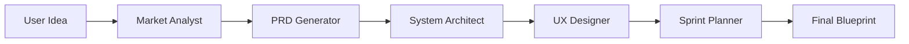

# MVP Agent v2.0 🚀

**AI-Powered Production-Ready PRD Generator with Financial Modeling & Competitive Analysis**  
*Turn your startup idea into a comprehensive, investor-ready blueprint in minutes.*

[](LICENSE)
[](https://www.python.org/)
[](https://deepmind.google/technologies/gemini/)
[](https://langchain-ai.github.io/langgraph/)
[](https://www.docker.com/)

**MVP Agent v2.0** is a sophisticated multi-agent system that transforms simple startup ideas into professional **Product Requirements Documents (PRDs)** with financial modeling, feature prioritization, and competitive analysis. 

Built on the **BMAD (Breakthrough Method for Agile AI-Driven Development)** methodology, it employs a team of specialized AI agents working in a **LangGraph** workflow to conduct market research, design architecture, and plan sprints—just like a real product team.

---

## ✨ v2.0 Key Features

### 🆕 **NEW in v2.0**
*   **💰 Financial Modeling**: Complete 3-year revenue projections, unit economics (CAC/LTV), burn rate, and break-even analysis
*   **⭐ Feature Prioritization**: RICE scoring, MoSCoW prioritization, and Value vs. Effort matrix
*   **🏆 Competitive Analysis**: Side-by-side feature comparison with 3-5 competitors
*   **🎨 Modern UI**: Enhanced interface with phase indicators, organized file explorer, and professional design
*   **📋 13 Documents**: Comprehensive PRD package (was 8, now 13 professional documents)
*   **🤖 Industry Templates**: Auto-detected templates for SaaS, Fintech, Healthtech, E-commerce, and more

### 🎯 **Core Features**
*   **🤖 Multi-Agent Orchestration**: Powered by **LangGraph**, simulating a full product team:
    *   **🕵️ Market Analyst**: Conducts real-time web research using **Gemini Grounding**.
    *   **💰 Financial Modeler**: Creates comprehensive financial projections and unit economics.
    *   **📝 PRD Generator**: Writes detailed specs following the **GitHub Spec Kit** standard.
    *   **🏗️ Architect**: Designs cloud-native systems and chooses tech stacks.
    *   **🎨 UX Designer**: Creates user flows, wireframes, and design systems.
    *   **📅 Sprint Planner**: Generates roadmaps, Gantt charts, and testing strategies.
*   **🌍 Native Search Grounding**: Uses Gemini's built-in Google Search grounding for accurate, cited market research.
*   **💻 Code Editor UI**: Modern, IDE-like interface with organized file explorer, syntax highlighting, and "Download as ZIP" functionality.
*   **📉 Token-Optimized**: Supports **TOON (Token-Oriented Object Notation)** format to reduce token usage by 30-60%.
*   **⚙️ Settings Manager**: Configure your own API keys, select models (Flash/Pro), and toggle features directly in the UI.
*   **🐳 Docker Ready**: Single-container deployment for easy hosting.

---

## 🏗️ System Architecture (BMAD Method)

The workflow follows a strict 4-phase process:

1.  **Analysis Phase**: The Market Analyst researches competitors and user pain points.
2.  **Planning Phase**: The PRD Generator creates functional requirements and user stories.
3.  **Solutioning Phase**: The Architect and UX Designer build the technical and visual foundation.
4.  **Implementation Phase**: The Sprint Planner outlines the roadmap and QA strategy.



---

## 🚀 Quick Start

### Option A: Docker (Recommended)

1.  **Build the image:**
    ```bash
    docker build -t mvp-agent .
    ```
2.  **Run the container:**
    ```bash
    docker run -p 7860:7860 mvp-agent
    ```
3.  **Open in Browser:** `http://localhost:7860`

### Option B: Local Installation

1.  **Clone the Repository:**
    ```bash
    git clone https://github.com/furqanahmadrao/MVP-Agent.git
    cd MVP-Agent
    ```

2.  **Set up Virtual Environment:**
    ```bash
    python -m venv venv
    # Windows
    venv\Scripts\activate
    # macOS/Linux
    source venv/bin/activate
    ```

3.  **Install Dependencies:**
    ```bash
    pip install -r requirements.txt
    ```

4.  **Run the Application:**
    ```bash
    python app.py
    ```

---

## 💻 Usage Guide

1.  **Settings**: Go to the **Settings** tab and enter your **Google Gemini API Key**.
    *   You can get one for free at [aistudio.google.com](https://aistudio.google.com/).
2.  **Generator**: Switch to the **Generator** tab.
3.  **Input**: Describe your startup idea (e.g., "A mobile app for tracking carbon footprint with gamification").
4.  **Generate**: Click "Generate Blueprint".
5.  **Watch**: Observe the "Mission Control" terminal as agents work through the phases.
6.  **Edit & Download**: Once complete, use the **Code Editor** tab to review, edit, and download your files.

---

## 📂 Generated Artifacts

### 📊 Complete PRD Package (13 Documents)

#### Phase 1: Analysis & Research
| File | Agent | Description |
|------|-------|-------------|
| `product_brief.md` | Market Analyst | Market size, competitors, user personas, and vision. |
| `financial_model.md` | Financial Modeler | 3-year revenue projections, unit economics (CAC/LTV), burn rate, funding requirements. |

#### Phase 2: Planning & Strategy
| File | Agent | Description |
|------|-------|-------------|
| `prd.md` | PRD Generator | Functional requirements, user stories, acceptance criteria. |
| `tech_spec.md` | PRD Generator | High-level technical approach and architecture decisions. |
| `feature_prioritization.md` | PRD Generator | RICE scores, MoSCoW prioritization, Value vs. Effort matrix. |
| `competitive_analysis.md` | PRD Generator | Feature-by-feature comparison with competitors, positioning strategy. |

#### Phase 3: Solution Design
| File | Agent | Description |
|------|-------|-------------|
| `architecture.md` | Architect | System diagrams, database schema, tech stack. |
| `user_flow.md` | UX Designer | User journeys, wireframes, and interaction patterns. |
| `design_system.md` | UX Designer | Colors, typography, and UI components. |

#### Phase 4: Implementation & Launch
| File | Agent | Description |
|------|-------|-------------|
| `roadmap.md` | Sprint Planner | Sprint breakdown and timeline. |
| `testing_plan.md` | Sprint Planner | QA strategy and test cases. |
| `deployment_guide.md` | Sprint Planner | Docker and CI/CD instructions. |

#### Additional
| File | Description |
|------|-------------|
| `overview.md` | High-level summary and quick start guide. |

---

## 💡 What Makes v2.0 Different?

### 1. **Financial Modeling** 💰
Unlike other PRD generators, v2.0 creates investor-ready financial models:
- Revenue projections with MRR/ARR growth
- Unit economics analysis (CAC, LTV, payback period)
- Burn rate and runway calculations
- Break-even analysis
- Sensitivity analysis for key variables

### 2. **Feature Prioritization** ⭐
Make data-driven decisions about what to build first:
- **RICE Scoring**: (Reach × Impact × Confidence) / Effort
- **MoSCoW**: Must/Should/Could/Won't-Have classification
- **Value vs. Effort Matrix**: Quick Wins, Major Projects, Fill-Ins, Time Sinks

### 3. **Competitive Intelligence** 🏆
Understand your competitive landscape:
- Feature-by-feature comparison tables
- Unique value proposition identification
- Competitive gaps analysis
- Positioning strategy recommendations

### 4. **Industry-Specific Templates** 🎯
Auto-detected templates for:
- SaaS B2B (SSO, RBAC, API access)
- Fintech (KYC/AML, PCI-DSS compliance)
- Healthtech (HIPAA, EHR integration)
- E-commerce (Payment gateways, inventory)
- Marketplace (Two-sided markets, escrow)
- And more...

---

## 🔧 Configuration

You can configure the application via the UI Settings tab or `.env` file:

### Environment Variables
Create a `.env` file in the root directory (copy from `.env.example`):
```bash
GEMINI_API_KEY=your_api_key_here
```

### UI Settings
- **API Key**: Set your Gemini API key in the Settings tab
- **Model Selection**: Choose between Gemini 2.5 Flash (fast) or Pro (powerful)
- **TOON Format**: Enable token optimization to reduce API costs by 30-60%
- **Project Complexity**: Auto-detect or manually set project level (0-4)

### Advanced Settings
- `GRADIO_SERVER_NAME`: Server host (default: 0.0.0.0)
- `GRADIO_SERVER_PORT`: Server port (default: 7860)
- `user_settings.json`: Stores UI preferences (auto-created, excluded from git)

---

## 🔒 Security & Production Readiness

**Current Status:** ✅ Phase 1 Security Fixes Complete (7/8 issues resolved)
**Deployment Readiness Score:** 7.5/10 (was 6/10)

### Recent Security Improvements:
- ✅ Path traversal vulnerabilities fixed in file manager
- ✅ MCP services bound to localhost only (no network exposure)
- ✅ Input validation and sanitization implemented
- ✅ ZIP bomb protection with size/count limits
- ✅ Thread-safe state management with per-session locks
- ✅ Request timeouts to prevent hung API calls
- ✅ Docker container runs as non-root user
- ✅ All dependencies pinned to specific versions
- ✅ `.dockerignore` created to prevent secret leakage

For detailed security information, see:
- [`SECURITY_REVIEW_FINDINGS.md`](SECURITY_REVIEW_FINDINGS.md) - Complete security audit
- [`SECURITY_FIXES_APPLIED.md`](SECURITY_FIXES_APPLIED.md) - Applied fixes and testing
- [`SECURITY_ISSUES_TRACKER.md`](SECURITY_ISSUES_TRACKER.md) - Ongoing issues tracking

### Production Deployment
The application is suitable for **development and staging** environments. For production deployment:
1. Complete remaining Phase 2 reliability fixes
2. Add monitoring and observability (Prometheus/Grafana)
3. Implement rate limiting and load balancing
4. Set up CI/CD with automated security scanning
5. Review compliance requirements (GDPR, SOC2, etc.)

---

## 🤝 Contributing

We welcome contributions! Here's how to get started:

1.  Fork the repository
2.  Create a feature branch (`git checkout -b feature/amazing-feature`)
3.  Make your changes following the coding guidelines in [`AGENTS.md`](AGENTS.md)
4.  Run security checks: `bandit -r src/ tools/`
5.  Test your changes thoroughly
6.  Commit your changes (`git commit -m 'Add amazing feature'`)
7.  Push to the branch (`git push origin feature/amazing-feature`)
8.  Open a Pull Request

### Development Guidelines
- Follow PEP 8 conventions with 4-space indentation
- Use `snake_case` for functions/variables, `PascalCase` for classes
- Add docstrings to all public functions
- Test on fresh virtual environment before submitting
- Keep security in mind - validate all inputs, avoid hardcoded secrets

For detailed guidelines, see [`AGENTS.md`](AGENTS.md).

---

## 📚 Documentation

- **[README.md](README.md)** - This file, main documentation
- **[AGENTS.md](AGENTS.md)** - Repository guidelines and coding standards
- **[SECURITY_REVIEW_FINDINGS.md](SECURITY_REVIEW_FINDINGS.md)** - Security audit results
- **[SECURITY_FIXES_APPLIED.md](SECURITY_FIXES_APPLIED.md)** - Applied security fixes
- **`.env.example`** - Environment variable template

---

## 🐛 Known Issues & Roadmap

### Current Limitations:
- Single API key shared across all users (multi-tenant support planned)
- No persistent storage (sessions cleared on restart)
- Limited to Gemini models (OpenAI/Anthropic support planned)
- Manual file editing in UI (real-time collaboration coming)

### Upcoming Features (v2.1):
- 💾 Database integration for persistent sessions
- 🔑 Multi-user authentication and authorization
- 🌐 OpenAI GPT-4 and Anthropic Claude support
- 📊 Usage analytics and cost tracking
- 🎯 Custom templates and industry presets
- 🔄 Git integration for version control
- 🧪 Automated testing framework

---

## 💬 Support & Community

- **Issues**: [GitHub Issues](https://github.com/furqanahmadrao/MVP-Agent/issues)
- **Discussions**: [GitHub Discussions](https://github.com/furqanahmadrao/MVP-Agent/discussions)
- **Pull Requests**: [Contributing Guide](#-contributing)

---

## 📄 License

MIT License. See [LICENSE](LICENSE) for details.

---

## 🙏 Acknowledgments

- **Google Gemini** for powerful AI capabilities with native search grounding
- **LangGraph** team for the excellent multi-agent orchestration framework
- **Gradio** for the beautiful UI framework
- **BMAD Method** for the structured development methodology
- All contributors and users who provide feedback and improvements

---

**Built with ❤️ using Gemini 2.5, LangGraph, and the BMAD methodology.**
