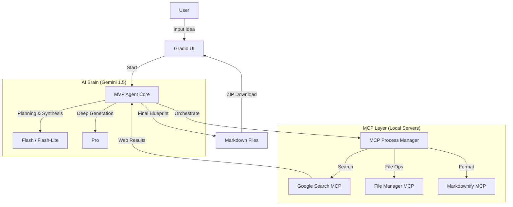

# MVP Agent 🚀

**AI-Powered MVP Blueprint Generator**  
*Built for the MCP Hackathon 2025 – Track 2: MCP In Action (Agents)*

[-red.svg)](#license)
[](https://www.python.org/)
[](https://deepmind.google/technologies/gemini/)
[](https://modelcontextprotocol.io/)

**MVP Agent** is an intelligent orchestrator that turns a simple startup idea into a comprehensive **Minimum Viable Product (MVP) Blueprint**. By leveraging the **Model Context Protocol (MCP)**, it coordinates specialized local servers and advanced Gemini AI models to conduct real-time market research, analyze technical requirements, and generate a complete execution plan.

---

## ✨ Key Features

*   **🤖 Multi-Model Intelligence**: Dynamically routes tasks to the best-fit model:
    *   **Gemini 1.5 Flash-Lite**: Fast, cost-effective initial planning and query generation.
    *   **Gemini 1.5 Flash**: High-speed research synthesis and summarization.
    *   **Gemini 1.5 Pro**: Deep reasoning for generating detailed technical and business documents.
*   **🌍 Autonomous Market Research**: Uses a custom **Google Search MCP** server to gather real-time data on competitors and user pain points, ensuring your MVP solves actual problems.
*   **🔌 Local MCP Orchestration**: Demonstrates "MCP In Action" by managing a suite of local MCP servers (`file-manager`, `google-search`, `markdownify`) that extend the agent's capabilities beyond its training data.
*   **📦 Comprehensive Blueprint**: Generates a downloadable ZIP containing 8 essential documents:
    1.  `overview.md`: Executive summary and vision.
    2.  `features.md`: Prioritized feature list (Must-Have vs. Nice-to-Have).
    3.  `architecture.md`: Tech stack, database schema, and system diagrams.
    4.  `design.md`: UI/UX principles and color palette.
    5.  `user_flow.md`: Step-by-step user journey.
    6.  `roadmap.md`: Development timeline and milestones.
    7.  `business_model.md`: Revenue streams, costs, and value proposition.
    8.  `testing_plan.md`: QA strategy and key test cases.

---

## 🏗️ System Architecture

The MVP Agent uses a **Hub-and-Spoke** architecture where the central `MVPAgent` orchestrates interactions between the user, AI models, and local MCP tools.



---

## 🛠️ Prerequisites

*   **Python 3.10+** installed on your system.
*   A **Google Gemini API Key** (Get one [here](https://aistudio.google.com/app/apikey)).

---

## 🚀 Installation & Setup

1.  **Clone the Repository**
    ```bash
    git clone https://github.com/yourusername/MVP-Agent.git
    cd MVP-Agent
    ```

2.  **Create a Virtual Environment**
    ```bash
    python -m venv venv
    # Windows
    venv\Scripts\activate
    # macOS/Linux
    source venv/bin/activate
    ```

3.  **Install Dependencies**
    ```bash
    pip install -r requirements.txt
    ```

4.  **Configure Environment Variables**
    Create a `.env` file in the root directory and add your API key:
    ```env
    GEMINI_API_KEY=your_actual_api_key_here
    ```

---

## 💻 Usage

1.  **Start the Application**
    This command launches the Gradio UI and automatically spins up the required local MCP servers in the background.
    ```bash
    python app.py
    ```

2.  **Access the Interface**
    Open your browser and navigate to:
    `http://localhost:7860` (or the port displayed in your terminal).

3.  **Generate Your MVP**
    *   Enter your startup idea in the text box.
    *   (Optional) configure platform and tech stack preferences.
    *   Click **"Generate MVP Blueprint"**.
    *   Watch the "Mission Control" log as the agent researches and plans.
    *   **Download** the complete blueprint as a ZIP file when finished.

---

## 📂 Project Structure

```text
MVP-Agent/
├── app.py                  # Main entry point & Gradio UI
├── requirements.txt        # Python dependencies
├── src/                    # Core Agent Logic
│   ├── agent_brain.py      # Main orchestration logic
│   ├── ai_models.py        # Gemini API client & routing
│   ├── mcp_process_manager.py # Manages local MCP subprocesses
│   └── prompts.py          # System prompts for different phases
└── tools/                  # Local MCP Server Implementations
    ├── google_search_mcp/  # Custom search tool
    ├── file_manager_mcp/   # File system operations
    └── markdownify_mcp/    # HTML to Markdown conversion
```

---

## ⚖️ License

**Copyright (c) 2025 Furqan Ahmad**

*   **Restricted Use**: This repository and its contents are proprietary until **November 30, 2025**. No copying, redistribution, or derivative works are allowed without express written permission.
*   **Future Open Source**: After November 30, 2025, this project will automatically be released under the **MIT License**.
*   **Hackathon Exception**: Judges and evaluators of the MCP Hackathon 2025 are granted permission to run and evaluate this software for judging purposes.

---

*Built with ❤️ for the future of AI Agents.*