# MVP Agent 🚀

**AI-Powered MVP Blueprint Generator**  
*Turn your startup idea into a comprehensive development blueprint*

[](LICENSE)
[](https://www.python.org/)
[](https://deepmind.google/technologies/gemini/)
[](https://modelcontextprotocol.io/)

**MVP Agent** is an intelligent orchestrator that transforms startup ideas into comprehensive **Minimum Viable Product (MVP) Blueprints**. By leveraging the **Model Context Protocol (MCP)**, it coordinates specialized local servers and advanced Gemini AI models to conduct real-time market research, analyze technical requirements, and generate a complete execution plan.

---

## ✨ Key Features

*   **🤖 Multi-Model Intelligence**: Dynamically routes tasks to the best-fit Gemini 2.5 model:
    *   **Gemini 2.5 Flash-Lite**: Fast, cost-effective initial planning and query generation.
    *   **Gemini 2.5 Flash**: High-speed research synthesis and summarization.
    *   **Gemini 2.5 Pro**: Deep reasoning for generating detailed technical and business documents.
*   **🌍 Autonomous Market Research**: Uses a custom **Google Search MCP** server to gather real-time data on competitors and user pain points, ensuring your MVP solves actual problems.
*   **🔌 Local MCP Orchestration**: Manages a suite of local MCP servers (`file-manager`, `google-search`, `markdownify`) that extend the agent's capabilities beyond its training data.
*   **📦 Comprehensive Blueprint**: Generates a downloadable ZIP containing 8 essential documents:
    1.  `overview.md`: Executive summary and vision.
    2.  `features.md`: Prioritized feature list (Must-Have vs. Nice-to-Have).
    3.  `architecture.md`: Tech stack, database schema, and system diagrams.
    4.  `design.md`: UI/UX principles and color palette.
    5.  `user_flow.md`: Step-by-step user journey.
    6.  `roadmap.md`: Development timeline and milestones.
    7.  `business_model.md`: Revenue streams, costs, and value proposition.
    8.  `testing_plan.md`: QA strategy and key test cases.
*   **⚡ Real-time Progress Tracking**: Live status updates with elapsed time, token usage, and detailed activity logs.
*   **🎨 Modern Web Interface**: Beautiful Gradio UI with dark theme and responsive design.

---

## 🏗️ System Architecture

The MVP Agent uses a **Hub-and-Spoke** architecture where the central `MVPAgent` orchestrates interactions between the user, AI models, and local MCP tools.

```mermaid
flowchart TD
    %% User Interface Layer
    User[👤 User] -->|Enters Idea + Config| GradioUI[🎨 Gradio UI<br/>app.py]
    GradioUI -->|Validates Input| Validators[⚖️ Input Validators<br/>src/validators.py]
    Validators -->|Sanitized Idea| GradioUI
    
    %% Core Orchestration
    GradioUI -->|Starts Generation| MVPAgent[🤖 MVP Agent Core<br/>src/agent_brain.py]
    MVPAgent -->|Status Updates| StatusDisplay[📊 Status Display<br/>Real-time Metrics]
    StatusDisplay -->|Shows Progress| GradioUI
    
    %% AI Model Layer
    MVPAgent -->|Route Tasks| ModelRouter[🔄 Model Router<br/>src/ai_models.py]
    ModelRouter -->|Simple Queries| FlashLite[⚡ Gemini 2.5 Flash-Lite<br/>Search Query Generation]
    ModelRouter -->|Research Synthesis| Flash[🚀 Gemini 2.5 Flash<br/>Research Analysis]
    ModelRouter -->|File Generation| Pro[🧠 Gemini 2.5 Pro<br/>MVP Document Creation]
    
    FlashLite -->|Generated Queries| MVPAgent
    Flash -->|Research Summary| MVPAgent
    Pro -->|8 MVP Documents| MVPAgent
    
    %% MCP Server Layer
    MVPAgent -->|Orchestrate Servers| MCPManager[🏗️ MCP Process Manager<br/>src/mcp_process_manager.py]
    MCPManager -->|Start/Stop| MCPServers[🔄 MCP Servers]
    
    subgraph MCPServers[🔌 Local MCP Servers]
        GoogleSearchMCP[🔍 Google Search MCP<br/>tools/google_search_mcp/run.py]
        FileManagerMCP[📁 File Manager MCP<br/>tools/file_manager_mcp/run.py]
        MarkdownifyMCP[📝 Markdownify MCP<br/>tools/markdownify_mcp/run.py]
    end
    
    %% External API Integrations
    GoogleSearchMCP -->|API Calls| GoogleAPI[🌐 Google Custom Search API]
    GoogleAPI -->|Search Results| GoogleSearchMCP
    GoogleSearchMCP -->|Structured Data| MVPAgent
    
    %% File Processing Flow
    MVPAgent -->|Save Files| FileManager[💾 File Manager<br/>src/file_manager.py]
    FileManager -->|Create ZIP| FileManagerMCP
    FileManagerMCP -->|ZIP Archive| GradioUI
    GradioUI -->|Download| User
    
    %% Error Handling
    MVPAgent -->|Error Events| ErrorHandler[⚠️ Error Handler<br/>src/error_handler.py]
    ErrorHandler -->|Log Errors| Logs[📋 Application Logs<br/>logs/ directory]
    ErrorHandler -->|User Messages| GradioUI
    
    %% State Management
    MVPAgent -->|Track Progress| AgentState[📊 Agent State<br/>Phase, Tokens, Metrics]
    AgentState -->|Update UI| StatusDisplay
    
    %% Environment Configuration
    subgraph Config[⚙️ Configuration]
        EnvVars[🔑 Environment Variables<br/>.env file]
        APIKeys[🔐 API Keys<br/>Gemini + Google Search]
    end
    
    MVPAgent -->|Requires| Config
    GoogleSearchMCP -->|Requires| Config
    
    %% Data Flow Styling
    linkStyle 0 stroke:blue,stroke-width:2px
    linkStyle 1 stroke:green,stroke-width:2px
    linkStyle 2 stroke:orange,stroke-width:2px
    linkStyle 3 stroke:purple,stroke-width:2px
    linkStyle 4 stroke:red,stroke-width:2px
```



---

## 🛠️ Prerequisites

*   **Python 3.10+** installed on your system
*   A **Google Gemini API Key** (Get one [here](https://aistudio.google.com/app/apikey))
*   A **Google Custom Search API Key** and **Search Engine ID** (Get them [here](https://console.cloud.google.com/apis/credentials))

---

## 🚀 Quick Start

### 1. Clone the Repository
```bash
git clone https://github.com/furqanahmadrao/MVP-Agent.git
cd MVP-Agent
```

### 2. Create a Virtual Environment
```bash
python -m venv venv

# Windows
venv\Scripts\activate

# macOS/Linux
source venv/bin/activate
```

### 3. Install Dependencies
```bash
pip install -r requirements.txt
```

### 4. Configure Environment Variables
Copy the example environment file and update with your API keys:
```bash
cp .env.example .env
```

Edit `.env` with your actual API keys:
```env
GEMINI_API_KEY=your_actual_gemini_api_key
GOOGLE_API_KEY=your_actual_google_search_api_key
GOOGLE_SEARCH_ENGINE_ID=your_actual_search_engine_id
```

### 5. Run the Application
```bash
python app.py
```

The application will automatically start all required MCP servers and launch the web interface.

### 6. Access the Interface
Open your browser and navigate to:
`http://localhost:7860` (or the port displayed in your terminal)

---

## 💻 Usage Guide

### Generating an MVP Blueprint

1.  **Enter Your Idea**: Describe your startup idea in the text box. Be specific about the problem you're solving and your target audience.

2.  **Configure Options** (Optional):
    *   **Target Platform**: Web App, Mobile App, Desktop, etc.
    *   **Preferred Tech Stack**: Specify technologies if you have preferences.
    *   **Constraints**: Budget limits, compliance requirements, or other constraints.

3.  **Generate**: Click the "Generate MVP Blueprint" button and watch the agent work through four phases:
    *   **Planning**: Understanding your idea and planning research queries.
    *   **Research**: Gathering real-time market data and competitor analysis.
    *   **Synthesis**: Analyzing research findings and identifying opportunities.
    *   **Generation**: Creating the complete MVP specification.

4.  **Download**: Once complete, download the comprehensive blueprint as a ZIP file containing all 8 documents.

### Advanced Configuration

The application supports several advanced options through the `.env` file:

```env
# Optional: Set specific ports for MCP servers
FILE_MANAGER_PORT=8081
GOOGLE_SEARCH_PORT=8082
MARKDOWNIFY_PORT=8083

# Optional: Hugging Face Hub token for Gradio OAuth
HUGGINGFACE_HUB_TOKEN=your_hf_token
```

---

## 📂 Project Structure

```text
MVP-Agent/
├── app.py                  # Main entry point & Gradio UI
├── requirements.txt        # Python dependencies
├── .env.example           # Environment variables template
├── LICENSE               # MIT License
├── src/                  # Core Agent Logic
│   ├── agent_brain.py      # Main orchestration logic
│   ├── ai_models.py        # Gemini API client & routing
│   ├── mcp_process_manager.py # Manages local MCP subprocesses
│   ├── prompts.py          # System prompts for different phases
│   ├── file_manager.py     # File operations and ZIP creation
│   ├── error_handler.py     # Error handling and logging
│   └── validators.py       # Input validation and sanitization
└── tools/                  # Local MCP Server Implementations
    ├── google_search_mcp/  # Custom search tool (Google API)
    ├── file_manager_mcp/   # File system operations
    └── markdownify_mcp/    # HTML to Markdown conversion
```

---

## 🔧 Development

### Running in Development Mode

For development and debugging, you can run individual components:

```bash
# Start just the Google Search MCP server
python tools/google_search_mcp/run.py

# Start the main application with debug logging
python app.py --debug
```

### Adding New MCP Servers

To add a new MCP server:

1.  Create a directory under `tools/` with your server implementation
2.  Update `src/mcp_process_manager.py` to include the new server configuration
3.  Add the server to the MCP manager's config list

### Customizing Prompts

Edit `src/prompts.py` to modify the system prompts for different phases of MVP generation.

---

## 🐛 Troubleshooting

### Common Issues

**"GEMINI_API_KEY not found"**
- Ensure your `.env` file exists and contains the correct API key
- Verify the key is valid and has sufficient quota

**"Google Search MCP failed"**
- Check that `GOOGLE_API_KEY` and `GOOGLE_SEARCH_ENGINE_ID` are set correctly
- Verify your Google Custom Search API is enabled

**Port conflicts**
- Change the default ports in `.env` if ports 7860, 8081, 8082, or 8083 are already in use

**Slow performance**
- The agent uses different Gemini models based on task complexity
- Complex ideas may take 5-10 minutes to generate comprehensive blueprints

### Logs

Check the `logs/` directory for detailed error logs:
- `logs/mcp_*.log`: MCP server logs
- `logs/app.log`: Main application logs

---

## 🤝 Contributing

We welcome contributions! Please feel free to submit issues and pull requests.

1.  Fork the repository
2.  Create a feature branch (`git checkout -b feature/amazing-feature`)
3.  Commit your changes (`git commit -m 'Add amazing feature'`)
4.  Push to the branch (`git push origin feature/amazing-feature`)
5.  Open a Pull Request

---

## 📄 License

This project is licensed under the MIT License - see the [LICENSE](LICENSE) file for details.

---

## 🙏 Acknowledgments

*   Google Gemini team for the powerful AI models
*   Gradio team for the excellent web interface framework
*   MCP community for the Model Context Protocol specification
*   All contributors who help improve this project

---

*Built with ❤️ for the future of AI Agents.*