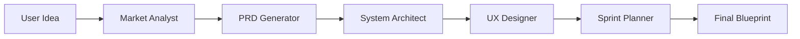

# Architecture

The MVP Agent is built on a sophisticated multi-agent architecture that leverages the power of LangGraph to orchestrate a team of specialized AI agents. This architecture is designed to be modular, scalable, and efficient, ensuring that the generated documents are of the highest quality.

## BMAD Methodology

The workflow is based on the **BMAD (Breakthrough Method for Agile AI-Driven Development)** methodology, which is a four-phase process that mirrors the structure of a real-world product team:

1.  **Analysis Phase:** The Market Analyst researches competitors and user pain points.
2.  **Planning Phase:** The PRD Generator creates functional requirements and user stories.
3.  **Solutioning Phase:** The Architect and UX Designer build the technical and visual foundation.
4.  **Implementation Phase:** The Sprint Planner outlines the roadmap and QA strategy.

## Multi-Agent Workflow

The multi-agent workflow is orchestrated by LangGraph, which is a library for building stateful, multi-agent applications with LLMs. The workflow is defined as a state graph, where each node represents an agent and each edge represents a transition between agents. The state of the workflow is stored in a shared `AgentState` object, which is passed between the agents as they execute.

## Agent Roles

The MVP Agent is composed of a team of specialized AI agents, each with a specific role and responsibility:

-   **Market Analyst:** Conducts real-time web research using Gemini Grounding to gather information about market size, trends, competitors, and user pain points.
-   **PRD Generator:** Writes detailed Product Requirements Documents (PRDs) and technical specifications, following the GitHub Spec Kit standard.
-   **System Architect:** Designs cloud-native systems, chooses tech stacks, and creates system diagrams and database schemas.
-   **UX Designer:** Creates user flows, wireframes, and design systems to ensure that the final product is user-friendly and visually appealing.
-   **Sprint Planner:** Generates Gantt charts, testing strategies, and deployment guides to ensure that the project is delivered on time and on budget.

## System Diagram

