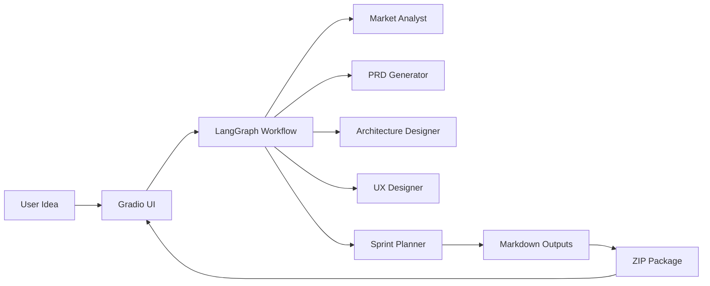

# Architecture Overview

This document describes the core runtime components and data flow for MVP Agent v2.0.

## High-level system design

MVP Agent is a Gradio-based web app that orchestrates a LangGraph workflow of specialized agents. Each agent produces a structured output, and the system aggregates these outputs into a single blueprint package.

## Core modules

| Module | Responsibility |
| --- | --- |
| `app.py` | Gradio UI, event wiring, and generation pipeline. |
| `src/workflow.py` | LangGraph state machine and phase orchestration. |
| `src/agents/*` | Agent implementations for analysis, PRD, architecture, UX, and planning. |
| `src/agent_state.py` | State schema, workflow phases, and helpers for status tracking. |
| `src/settings.py` | Persistent settings and API key management. |
| `src/file_manager.py` | Creates ZIP archives of generated markdown outputs. |

## Workflow phases

1. **Detect Level**: infers project complexity level (0-4).
2. **Analysis**: produces product brief and research artifacts.
3. **Planning**: generates PRD and tech spec.
4. **Solutioning**: produces architecture diagrams and UX flows.
5. **Implementation**: builds roadmap, testing plan, and deployment guidance.
6. **Finalize**: generates overview and aggregates outputs.

## Data flow and state

- `AgentState` contains the idea, API key, phase, and all generated artifacts.
- Each phase updates the state with new markdown content.
- Status updates are appended to `status_history` for rendering in the UI.

## Observability

The UI renders a "Mission Control" status terminal, populated by the workflow status history. In the current implementation, status updates are generated during synchronous execution and replayed when the workflow completes.

## Extension points

- **Agents**: add or replace agents in `src/agents/` and wire them into the workflow.
- **Models**: configure the Gemini model in the Settings panel.
- **Artifacts**: extend output formats by adding new keys to the workflow state and editor file list.
